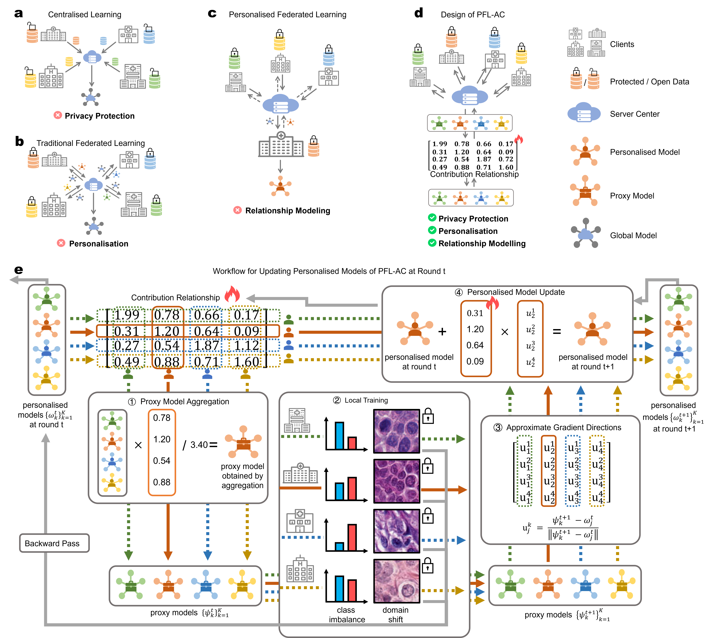

# PFLinMedicine

This is the official implementation of **"Personalised Federated Learning with Asymmetric Client Collaboration"**



## Setup
Clone the repo and install the required packages.
```
    git clone https://github.com/Hongyao-Chen/PFLinMedicine.git
    cd PFLinMedicine
    conda create -n pflinmedicine python=3.11
    conda activate pflinmedicine
    pip install -r requirements.txt
```

## Quick Start Cifar100
- generate Cifar100 dataset
    ```
    cd .\dataset\
    python generate_Cifar100.py noniid - dir  
    ```
- run PFL-AC/Lay-PFL-AC on Cifar100
    ```
    cd .\system\
    python main.py --data Cifar100 --algo PFL-AC --global_lr 0.02 --ar_lr 0.05 --num_classes 100 --model CNN
    python main.py --data Cifar100 --algo Lay-PFL-AC --global_lr 0.05 --ar_lr 0.02 --num_classes 100 --model CNN
    ```

## Quick Start MIDOG++
- download MIDOG++ dataset
    ```
    cd .\dataset\
    python download_MIDOG.py
    ```
- generate MIDOGpp dataset
    ```
    python generate_MIDOG.py
    ```

- run PFL-AC/Lay-PFL-AC on MIDOGpp 
    ```
    cd .\system\
    python main.py --data MIDOGpp --algo PFL-AC --global_lr 0.02 --ar_lr 0.05 --num_classes 7 --model CNN --num_clients 7
    python main.py --data MIDOGpp --algo Lay-PFL-AC --global_lr 0.05 --ar_lr 0.02 --num_classes 7 --model CNN --num_clients 7    
  ```
  
🎯**This code is built on [PFLlib](https://github.com/TsingZ0/PFLlib)：**
